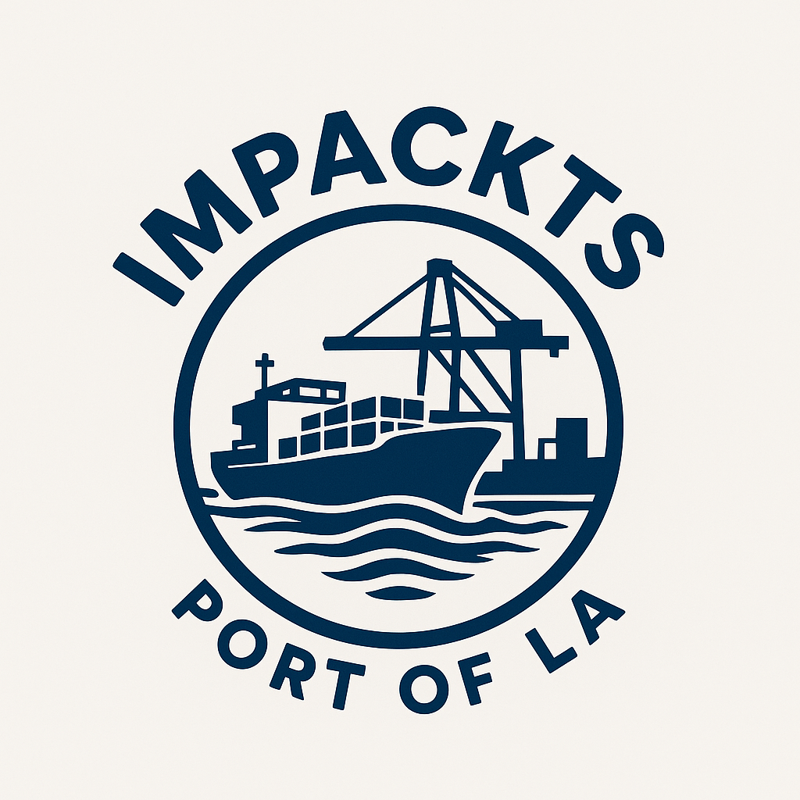

  

# CEGM2003-Ports-project
This project is part of the CEGM 2003 course and focuses on identifying functional port areas using AIS vessel data and satellite imagery. A case study of the Port of Los Angeles is conducted using August 2024 AIS data and optical imagery. K-means, DBSCAN and spectral clustering are applied to detect port activities and validated using spatial metrics. 

The data is not included in this repository, but can be found in the following link: https://surfdrive.surf.nl/s/Ek47keeeRdfYKij

Authors: 

Christos Paraschakis\
Ilias Angelos Gavanozis Vlassis \
Korina Detsi 
